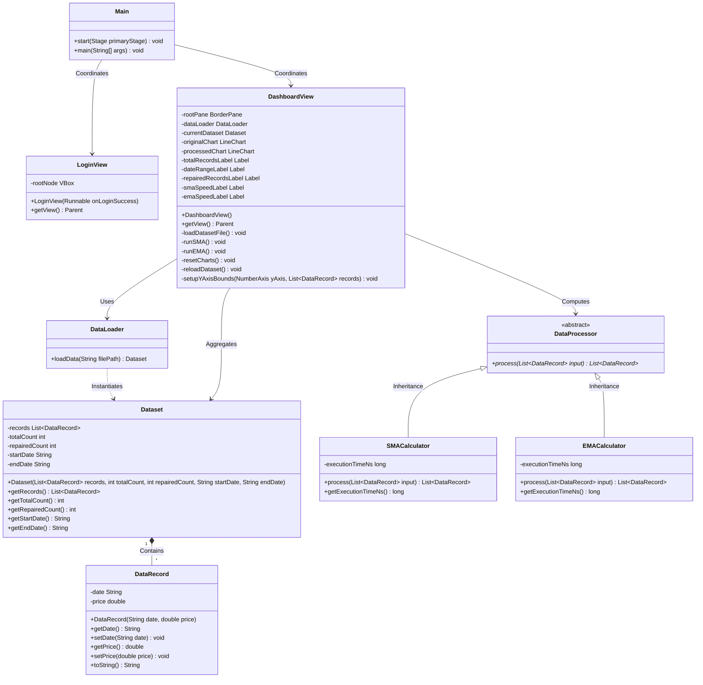

# Final Lab Project: Comparative Data Analytics Dashboard & Speed Analyzer
**Course**: CS - Object Oriented Programming / Software Development Lab  
**Student Name**: [Your Name Here]  
**Student ID**: [Your Student ID Here]

---

## Page 1: Architecture Mapping & Algorithmic Focus

### Target Problem Statement
1. In financial markets like the Pakistan Stock Exchange, KSE-100 index tracking systems require extremely responsive interfaces to handle large streams of historical price data.
2. However, raw financial datasets loaded from storage mediums often contain corrupted entries, empty fields, or syntax errors that disrupt parsing.
3. Failure to handle these records gracefully leads to application crashes, while unoptimized data smoothing logic introduces interface lag.
4. To resolve this, our desktop application provides a robust validation layer that repairs data dynamically and uses high-resolution timers to compare the processing efficiency of SMA and EMA algorithms.

### System Architecture Layout
```text
[ Local File (.txt) ] ──> [ Data Validation Layer ] ──> [ Java Array (ArrayList) ] ──> [ Speed Timer & Code Engine ] ──> [ Side-by-Side Charts ]
```

### UML Class Diagram (Mermaid Definition)


---

## Page 2: Visual Interface Walkthrough

### Screenshot 1: Secure Login View
* **Description**: This is the functional login view prompting for credentials. Access is restricted using the default username `admin` and password `admin123`. Entering empty or incorrect parameters triggers a red validation message in the bottom label.
* **[PASTE YOUR LOGIN PAGE SCREENSHOT HERE]**

### Screenshot 2: Initial Dashboard View
* **Description**: The main dashboard screen immediately upon successful login. The original KSE-100 historical data is loaded from the file, validated, and plotted exclusively on the left chart. The right chart remains completely blank until an algorithm runs.
* **[PASTE YOUR INITIAL EMPTY RIGHT-CHART DASHBOARD SCREENSHOT HERE]**

### Screenshot 3: Processed Dashboard View (SMA/EMA Calculations executed)
* **Description**: The dashboard state after executing the moving average calculations. The right chart displays the smoothed trend output. Both performance boxes at the bottom display the execution speed simultaneously (e.g., `SMA Speed: 120,400 ns` and `EMA Speed: 95,200 ns`).
* **[PASTE YOUR PROCESSED DASHBOARD SCREENSHOT HERE]**

---

## Page 3: Key Code Highlights (Validation & Timers)

### 1. Try-Catch Data Validation & Recovery Layer (DataLoader.java)
```java
// ==========================================
// TRY-CATCH VALIDATION START
// ==========================================
try {
    if (cleanLine.contains(",")) {
        String[] parts = cleanLine.split(",", -1);
        if (parts.length >= 2) {
            String rawDate = parts[0].trim();
            String rawPrice = parts[1].trim();

            if (rawDate.isEmpty()) {
                throw new IllegalArgumentException("Empty date field");
            }
            date = rawDate;

            if (rawPrice.isEmpty()) {
                throw new IllegalArgumentException("Empty price field");
            }
            price = Double.parseDouble(rawPrice);
        } else {
            throw new IllegalArgumentException("Incorrect number of comma-separated tokens");
        }
    } else {
        throw new IllegalArgumentException("Missing comma separator");
    }

    // On successful parse, update previous valid values
    previousDate = date;
    previousPrice = price;

} catch (Exception e) {
    isCorrupt = true;
    repairedCount++;
    // Data Recovery Rule: Repair with previous valid price, and log the validation error
    price = previousPrice;
    System.err.println("VALIDATION LAYER WARNING: Repaired corrupt row '" + trimmed 
            + "' at line index " + totalCount + ". Swapped price with previous valid: " 
            + price + ". Error context: " + e.getMessage());
}
// ==========================================
// TRY-CATCH VALIDATION END
// ==========================================
```

### 2. SMA Code Timer Execution Boundary (SMACalculator.java)
```java
// ==========================================
// PERFORMANCE TIMER START
// ==========================================
long startTime = System.nanoTime();

for (int i = 0; i < n; i++) {
    double prevPrice = (i == 0) ? input.get(i).getPrice() : input.get(i - 1).getPrice();
    double currPrice = input.get(i).getPrice();
    double nextPrice = (i == n - 1) ? input.get(i).getPrice() : input.get(i + 1).getPrice();

    double smaValue = (prevPrice + currPrice + nextPrice) / 3.0;
    output.add(new DataRecord(input.get(i).getDate(), smaValue));
}

long endTime = System.nanoTime();
// ==========================================
// PERFORMANCE TIMER END
// ==========================================
```

### 3. EMA Code Timer Execution Boundary (EMACalculator.java)
```java
// ==========================================
// PERFORMANCE TIMER START
// ==========================================
long startTime = System.nanoTime();

// Initial EMA setup: EMA_0 = Price_0
double previousEma = input.get(0).getPrice();
output.add(new DataRecord(input.get(0).getDate(), previousEma));

for (int i = 1; i < n; i++) {
    double currentPrice = input.get(i).getPrice();
    double emaValue = currentPrice * alpha + previousEma * (1.0 - alpha);
    output.add(new DataRecord(input.get(i).getDate(), emaValue));
    previousEma = emaValue;
}

long endTime = System.nanoTime();
// ==========================================
// PERFORMANCE TIMER END
// ==========================================
```

---

## Page 4: Short Reflection

1. Comparing the two processing structures, the Exponential Moving Average (EMA) algorithm runs faster because it requires a constant number of operations per element, whereas the Simple Moving Average (SMA) performs an extra addition and division for each data point.
2. The measured execution time in nanoseconds fluctuates slightly with each run because of operating system thread scheduling, CPU cache state variations, and Java Virtual Machine garbage collection pauses occurring in the background.
3. Additionally, modern CPUs dynamically adjust clock speeds based on current thermal conditions and power profiles, introducing microsecond fluctuations for identical code loops.

---

## Appendix: Full Source Code

### 1. Main.java
```java
package com.kse100;

import com.kse100.ui.LoginView;
import com.kse100.ui.DashboardView;
import javafx.application.Application;
import javafx.scene.Scene;
import javafx.scene.layout.StackPane;
import javafx.stage.Stage;

public class Main extends Application {
    private Stage stage;

    @Override
    public void start(Stage primaryStage) {
        this.stage = primaryStage;
        primaryStage.setTitle("KSE-100 Comparative Analytics Dashboard & Speed Analyzer");

        StackPane loginRoot = new StackPane();
        loginRoot.setStyle("-fx-background-color: #0b0c10;");
        
        LoginView loginView = new LoginView(this::showDashboard);
        loginRoot.getChildren().add(loginView.getView());

        Scene loginScene = new Scene(loginRoot, 520, 440);
        
        try {
            loginScene.getStylesheets().add(getClass().getResource("/style.css").toExternalForm());
        } catch (Exception e) {
            System.err.println("CSS STYLING WARNING: Could not load stylesheet from classpath: " + e.getMessage());
        }

        primaryStage.setScene(loginScene);
        primaryStage.setResizable(false);
        primaryStage.centerOnScreen();
        primaryStage.show();
    }

    private void showDashboard() {
        DashboardView dashboardView = new DashboardView();
        Scene dashboardScene = new Scene(dashboardView.getView(), 1280, 780);
        
        try {
            dashboardScene.getStylesheets().add(getClass().getResource("/style.css").toExternalForm());
        } catch (Exception e) {
            System.err.println("CSS STYLING WARNING: Could not load stylesheet from classpath: " + e.getMessage());
        }

        stage.setResizable(true);
        stage.setScene(dashboardScene);
        stage.centerOnScreen();
    }

    public static void main(String[] args) {
        launch(args);
    }
}
```

### 2. DataRecord.java
```java
package com.kse100.model;

public class DataRecord {
    private String date;
    private double price;

    public DataRecord(String date, double price) {
        this.date = date;
        this.price = price;
    }

    public String getDate() {
        return date;
    }

    public void setDate(String date) {
        this.date = date;
    }

    public double getPrice() {
        return price;
    }

    public void setPrice(double price) {
        this.price = price;
    }

    @Override
    public String toString() {
        return "DataRecord[Date=" + date + ", Price=" + price + "]";
    }
}
```

### 3. Dataset.java
```java
package com.kse100.model;

import java.util.List;

public class Dataset {
    private final List<DataRecord> records;
    private final int totalCount;
    private final int repairedCount;
    private final String startDate;
    private final String endDate;

    public Dataset(List<DataRecord> records, int totalCount, int repairedCount, String startDate, String endDate) {
        this.records = records;
        this.totalCount = totalCount;
        this.repairedCount = repairedCount;
        this.startDate = startDate;
        this.endDate = endDate;
    }

    public List<DataRecord> getRecords() {
        return records;
    }

    public int getTotalCount() {
        return totalCount;
    }

    public int getRepairedCount() {
        return repairedCount;
    }

    public String getStartDate() {
        return startDate;
    }

    public String getEndDate() {
        return endDate;
    }
}
```

### 4. DataLoader.java
```java
package com.kse100.service;

import com.kse100.model.DataRecord;
import com.kse100.model.Dataset;

import java.io.BufferedReader;
import java.io.FileReader;
import java.io.IOException;
import java.util.ArrayList;
import java.util.List;

public class DataLoader {

    public Dataset loadData(String filePath) {
        List<DataRecord> records = new ArrayList<>();
        int totalCount = 0;
        int repairedCount = 0;

        String previousDate = "2023-01-01";
        double previousPrice = 40350.25;

        try (BufferedReader br = new BufferedReader(new FileReader(filePath))) {
            String line;
            while ((line = br.readLine()) != null) {
                String trimmed = line.trim();
                if (trimmed.isEmpty()) {
                    continue;
                }

                totalCount++;

                String cleanLine = trimmed;
                if (cleanLine.startsWith("[")) {
                    cleanLine = cleanLine.substring(1);
                }
                if (cleanLine.endsWith("]")) {
                    cleanLine = cleanLine.substring(0, cleanLine.length() - 1);
                }
                cleanLine = cleanLine.replace("'", "").replace("\"", "").trim();

                String date = previousDate;
                double price = previousPrice;

                try {
                    if (cleanLine.contains(",")) {
                        String[] parts = cleanLine.split(",", -1);
                        if (parts.length >= 2) {
                            String rawDate = parts[0].trim();
                            String rawPrice = parts[1].trim();

                            if (rawDate.isEmpty()) {
                                throw new IllegalArgumentException("Empty date field");
                            }
                            date = rawDate;

                            if (rawPrice.isEmpty()) {
                                throw new IllegalArgumentException("Empty price field");
                            }
                            price = Double.parseDouble(rawPrice);
                        } else {
                            throw new IllegalArgumentException("Incorrect number of comma-separated tokens");
                        }
                    } else {
                        throw new IllegalArgumentException("Missing comma separator");
                    }

                    previousDate = date;
                    previousPrice = price;

                } catch (Exception e) {
                    repairedCount++;
                    price = previousPrice;
                    System.err.println("VALIDATION LAYER WARNING: Repaired corrupt row '" + trimmed 
                            + "' at line index " + totalCount + ". Swapped price with previous valid: " 
                            + price + ". Error context: " + e.getMessage());
                }

                records.add(new DataRecord(date, price));
            }
        } catch (IOException e) {
            System.err.println("CRITICAL FILE ERROR: Failed to read from " + filePath + ". Msg: " + e.getMessage());
        }

        String startDate = records.isEmpty() ? "N/A" : records.get(0).getDate();
        String endDate = records.isEmpty() ? "N/A" : records.get(records.size() - 1).getDate();

        return new Dataset(records, totalCount, repairedCount, startDate, endDate);
    }
}
```

### 5. DataProcessor.java
```java
package com.kse100.service;

import com.kse100.model.DataRecord;
import java.util.List;

public abstract class DataProcessor {
    public abstract List<DataRecord> process(List<DataRecord> input);
}
```

### 6. SMACalculator.java
```java
package com.kse100.service;

import com.kse100.model.DataRecord;
import java.util.ArrayList;
import java.util.List;

public class SMACalculator extends DataProcessor {
    private long executionTimeNs = 0;

    @Override
    public List<DataRecord> process(List<DataRecord> input) {
        List<DataRecord> output = new ArrayList<>();
        if (input == null || input.isEmpty()) {
            executionTimeNs = 0;
            return output;
        }

        int n = input.size();

        long startTime = System.nanoTime();

        for (int i = 0; i < n; i++) {
            double prevPrice = (i == 0) ? input.get(i).getPrice() : input.get(i - 1).getPrice();
            double currPrice = input.get(i).getPrice();
            double nextPrice = (i == n - 1) ? input.get(i).getPrice() : input.get(i + 1).getPrice();

            double smaValue = (prevPrice + currPrice + nextPrice) / 3.0;
            output.add(new DataRecord(input.get(i).getDate(), smaValue));
        }

        long endTime = System.nanoTime();

        executionTimeNs = endTime - startTime;
        return output;
    }

    public long getExecutionTimeNs() {
        return executionTimeNs;
    }
}
```

### 7. EMACalculator.java
```java
package com.kse100.service;

import com.kse100.model.DataRecord;
import java.util.ArrayList;
import java.util.List;

public class EMACalculator extends DataProcessor {
    private long executionTimeNs = 0;

    @Override
    public List<DataRecord> process(List<DataRecord> input) {
        List<DataRecord> output = new ArrayList<>();
        if (input == null || input.isEmpty()) {
            executionTimeNs = 0;
            return output;
        }

        int n = input.size();
        double alpha = 0.2;

        long startTime = System.nanoTime();

        double previousEma = input.get(0).getPrice();
        output.add(new DataRecord(input.get(0).getDate(), previousEma));

        for (int i = 1; i < n; i++) {
            double currentPrice = input.get(i).getPrice();
            double emaValue = currentPrice * alpha + previousEma * (1.0 - alpha);
            output.add(new DataRecord(input.get(i).getDate(), emaValue));
            previousEma = emaValue;
        }

        long endTime = System.nanoTime();

        executionTimeNs = endTime - startTime;
        return output;
    }

    public long getExecutionTimeNs() {
        return executionTimeNs;
    }
}
```

### 8. LoginView.java
```java
package com.kse100.ui;

import javafx.geometry.Pos;
import javafx.scene.Parent;
import javafx.scene.control.*;
import javafx.scene.layout.VBox;
import java.io.*;

/**
 * Creates the Secure Login & Registration View layout and logic.
 * Dynamically registers new accounts and persists them inside a local text file.
 */
public class LoginView {
    private final VBox rootNode;
    private final Runnable onLoginSuccess;
    private static final String CREDENTIALS_FILE = "users.txt";

    /**
     * Initializes the login view with state transitions.
     * @param onLoginSuccess Callback triggered on successful validation
     */
    public LoginView(Runnable onLoginSuccess) {
        this.rootNode = new VBox(12);
        this.rootNode.setAlignment(Pos.CENTER);
        this.rootNode.getStyleClass().add("card-panel");
        this.rootNode.setMinWidth(400);
        this.rootNode.setMaxWidth(400);
        this.rootNode.setMinHeight(380);
        this.rootNode.setMaxHeight(420);
        this.onLoginSuccess = onLoginSuccess;

        initializeCredentialsFile();
        showLoginForm();
    }

    /**
     * Ensures the credentials file exists and contains the default admin account.
     */
    private void initializeCredentialsFile() {
        File file = new File(CREDENTIALS_FILE);
        if (!file.exists()) {
            try (PrintWriter pw = new PrintWriter(new FileWriter(file))) {
                pw.println("admin,admin123");
            } catch (IOException e) {
                System.err.println("Error creating default credentials file: " + e.getMessage());
            }
        }
    }

    /**
     * Renders the Sign In layout form.
     */
    private void showLoginForm() {
        rootNode.getChildren().clear();

        Label title = new Label("KSE-100 Portal");
        title.getStyleClass().add("title-label");
        title.setStyle("-fx-font-size: 22px;");

        Label subtitle = new Label("Sign in to access analytics");
        subtitle.getStyleClass().add("subtitle-label");

        TextField usernameField = new TextField();
        usernameField.setPromptText("Username");

        PasswordField passwordField = new PasswordField();
        passwordField.setPromptText("Password");

        Button loginBtn = new Button("Secure Login");
        loginBtn.setMaxWidth(Double.MAX_VALUE);

        Button signupModeBtn = new Button("Create an Account");
        signupModeBtn.getStyleClass().add("btn-action-grey");
        signupModeBtn.setMaxWidth(Double.MAX_VALUE);

        Label errorLabel = new Label();
        errorLabel.getStyleClass().add("error-label");

        loginBtn.setOnAction(e -> {
            String username = usernameField.getText().trim();
            String password = passwordField.getText();

            if (username.isEmpty() || password.isEmpty()) {
                errorLabel.setText("Please enter credentials.");
            } else if (validateLogin(username, password)) {
                errorLabel.setText("");
                onLoginSuccess.run();
            } else {
                errorLabel.setText("Access Denied: Invalid Username/Password.");
            }
        });

        signupModeBtn.setOnAction(e -> showRegisterForm());

        passwordField.setOnAction(e -> loginBtn.fire());
        usernameField.setOnAction(e -> passwordField.requestFocus());

        rootNode.getChildren().addAll(title, subtitle, usernameField, passwordField, loginBtn, signupModeBtn, errorLabel);
    }

    /**
     * Renders the Register/Sign Up layout form.
     */
    private void showRegisterForm() {
        rootNode.getChildren().clear();

        Label title = new Label("Create Account");
        title.getStyleClass().add("title-label");
        title.setStyle("-fx-font-size: 22px;");

        Label subtitle = new Label("Register new user credentials");
        subtitle.getStyleClass().add("subtitle-label");

        TextField usernameField = new TextField();
        usernameField.setPromptText("New Username");

        PasswordField passwordField = new PasswordField();
        passwordField.setPromptText("New Password");

        PasswordField confirmPasswordField = new PasswordField();
        confirmPasswordField.setPromptText("Confirm Password");

        Button registerBtn = new Button("Register Account");
        registerBtn.setMaxWidth(Double.MAX_VALUE);

        Button loginModeBtn = new Button("Back to Login");
        loginModeBtn.getStyleClass().add("btn-action-grey");
        loginModeBtn.setMaxWidth(Double.MAX_VALUE);

        Label errorLabel = new Label();
        errorLabel.getStyleClass().add("error-label");

        registerBtn.setOnAction(e -> {
            String username = usernameField.getText().trim();
            String password = passwordField.getText();
            String confirmPassword = confirmPasswordField.getText();

            if (username.isEmpty() || password.isEmpty()) {
                errorLabel.setStyle("-fx-text-fill: #ef4444;");
                errorLabel.setText("Username and password cannot be empty.");
            } else if (!password.equals(confirmPassword)) {
                errorLabel.setStyle("-fx-text-fill: #ef4444;");
                errorLabel.setText("Passwords do not match.");
            } else {
                boolean success = registerUser(username, password);
                if (success) {
                    errorLabel.setStyle("-fx-text-fill: #00e676;");
                    errorLabel.setText("Registration successful! Loading login...");
                    
                    // Switch back to Login Form after a short delay
                    javafx.animation.PauseTransition pause = new javafx.animation.PauseTransition(javafx.util.Duration.seconds(1.5));
                    pause.setOnFinished(ev -> showLoginForm());
                    pause.play();
                } else {
                    errorLabel.setStyle("-fx-text-fill: #ef4444;");
                    errorLabel.setText("Username already exists.");
                }
            }
        });

        loginModeBtn.setOnAction(e -> showLoginForm());

        rootNode.getChildren().addAll(title, subtitle, usernameField, passwordField, confirmPasswordField, registerBtn, loginModeBtn, errorLabel);
    }

    /**
     * Validates matching credentials from the local users file.
     */
    private boolean validateLogin(String username, String password) {
        try (BufferedReader br = new BufferedReader(new FileReader(CREDENTIALS_FILE))) {
            String line;
            while ((line = br.readLine()) != null) {
                String[] parts = line.split(",");
                if (parts.length >= 2) {
                    if (parts[0].trim().equals(username) && parts[1].trim().equals(password)) {
                        return true;
                    }
                }
            }
        } catch (IOException e) {
            System.err.println("Error reading credentials file: " + e.getMessage());
        }
        return false;
    }

    /**
     * Saves new user credentials to the local users file if not already existing.
     */
    private boolean registerUser(String username, String password) {
        try (BufferedReader br = new BufferedReader(new FileReader(CREDENTIALS_FILE))) {
            String line;
            while ((line = br.readLine()) != null) {
                String[] parts = line.split(",");
                if (parts.length >= 2) {
                    if (parts[0].trim().equalsIgnoreCase(username)) {
                        return false; // Account already exists
                    }
                }
            }
        } catch (IOException e) {
            // Handled if file is missing
        }

        try (PrintWriter pw = new PrintWriter(new FileWriter(CREDENTIALS_FILE, true))) {
            pw.println(username + "," + password);
            return true;
        } catch (IOException e) {
            System.err.println("Error saving credentials to file: " + e.getMessage());
            return false;
        }
    }

    /**
     * Exposes the root login view node.
     * @return Parent root node
     */
    public Parent getView() {
        return this.rootNode;
    }
}
```

### 9. DashboardView.java
```java
package com.kse100.ui;

import com.kse100.model.DataRecord;
import com.kse100.model.Dataset;
import com.kse100.service.DataLoader;
import com.kse100.service.SMACalculator;
import com.kse100.service.EMACalculator;

import javafx.collections.FXCollections;
import javafx.geometry.Insets;
import javafx.geometry.Pos;
import javafx.scene.Parent;
import javafx.scene.chart.LineChart;
import javafx.scene.chart.NumberAxis;
import javafx.scene.chart.XYChart;
import javafx.scene.control.Button;
import javafx.scene.control.ComboBox;
import javafx.scene.control.Label;
import javafx.scene.layout.*;
import javafx.util.StringConverter;
import java.util.ArrayList;
import java.util.List;
import java.util.stream.Collectors;

public class DashboardView {
    private final BorderPane rootPane;
    private final DataLoader dataLoader;
    private Dataset currentDataset;
    private List<DataRecord> filteredRecords;

    private final LineChart<Number, Number> originalChart;
    private final LineChart<Number, Number> processedChart;

    private XYChart.Series<Number, Number> smaSeries;
    private XYChart.Series<Number, Number> emaSeries;

    private final Label totalRecordsLabel;
    private final Label dateRangeLabel;
    private final Label repairedRecordsLabel;

    private final Label minPriceLabel;
    private final Label maxPriceLabel;
    private final Label meanPriceLabel;
    private final Label stdDevPriceLabel;

    private final Label smaSpeedLabel;
    private final Label emaSpeedLabel;

    private final ComboBox<String> dateRangeComboBox;

    public DashboardView() {
        this.rootPane = new BorderPane();
        this.rootPane.setPadding(new Insets(20));
        this.dataLoader = new DataLoader();
        this.filteredRecords = new ArrayList<>();

        VBox topContainer = new VBox(15);
        topContainer.setPadding(new Insets(0, 0, 15, 0));

        HBox headerRow = new HBox();
        headerRow.setAlignment(Pos.CENTER_LEFT);
        
        VBox titleArea = new VBox(5);
        Label title = new Label("KSE-100 Comparative Analytics Dashboard");
        title.getStyleClass().add("title-label");
        Label subtitle = new Label("Pakistan Stock Exchange (PSX) Performance & Code Optimization Engine");
        subtitle.getStyleClass().add("subtitle-label");
        titleArea.getChildren().addAll(title, subtitle);
        HBox.setHgrow(titleArea, Priority.ALWAYS);

        VBox dropdownArea = new VBox(5);
        dropdownArea.setAlignment(Pos.CENTER_RIGHT);
        Label filterLabel = new Label("Select Date Range:");
        filterLabel.getStyleClass().add("stats-title");
        
        dateRangeComboBox = new ComboBox<>(FXCollections.observableArrayList(
            "All Data (3 Years)",
            "Year 2023",
            "Year 2024",
            "Year 2025",
            "Year 2026"
        ));
        dateRangeComboBox.setValue("All Data (3 Years)");
        dateRangeComboBox.getStyleClass().add("combo-box");
        dateRangeComboBox.setOnAction(e -> handleFilterChange());
        dropdownArea.getChildren().addAll(filterLabel, dateRangeComboBox);

        headerRow.getChildren().addAll(titleArea, dropdownArea);

        FlowPane statsFlowPane = new FlowPane();
        statsFlowPane.setHgap(15);
        statsFlowPane.setVgap(10);
        statsFlowPane.setAlignment(Pos.CENTER_LEFT);

        VBox totalPill = createStatsPill("TOTAL RECORDS", totalRecordsLabel = new Label("0"), false);
        VBox rangePill = createStatsPill("DATE RANGE", dateRangeLabel = new Label("N/A"), false);
        VBox repairPill = createStatsPill("REPAIRED VALUES", repairedRecordsLabel = new Label("0"), true);

        VBox minPill = createAnalyticsPill("MIN PRICE", minPriceLabel = new Label("N/A"), "#ef4444");
        VBox maxPill = createAnalyticsPill("MAX PRICE", maxPriceLabel = new Label("N/A"), "#00e676");
        VBox meanPill = createAnalyticsPill("MEAN (AVERAGE)", meanPriceLabel = new Label("N/A"), "#3b82f6");
        VBox stdDevPill = createAnalyticsPill("VOLATILITY (STD DEV)", stdDevPriceLabel = new Label("N/A"), "#a855f7");

        statsFlowPane.getChildren().addAll(totalPill, rangePill, repairPill, minPill, maxPill, meanPill, stdDevPill);

        topContainer.getChildren().addAll(headerRow, statsFlowPane);
        this.rootPane.setTop(topContainer);

        HBox chartsContainer = new HBox(15);
        chartsContainer.setAlignment(Pos.CENTER);
        VBox.setVgrow(chartsContainer, Priority.ALWAYS);
        HBox.setHgrow(chartsContainer, Priority.ALWAYS);

        NumberAxis originalX = new NumberAxis();
        originalX.setLabel("Timeline (Dates)");
        originalX.setTickLabelsVisible(false);
        originalX.setTickMarkVisible(false);
        NumberAxis originalY = new NumberAxis();
        originalY.setLabel("Index Value (PKR)");
        originalChart = new LineChart<>(originalX, originalY);
        originalChart.setTitle("KSE-100 Original Index Data");
        originalChart.setAnimated(false);
        originalChart.setCreateSymbols(false);
        HBox.setHgrow(originalChart, Priority.ALWAYS);

        NumberAxis processedX = new NumberAxis();
        processedX.setLabel("Timeline (Dates)");
        processedX.setTickLabelsVisible(false);
        processedX.setTickMarkVisible(false);
        NumberAxis processedY = new NumberAxis();
        processedY.setLabel("Filtered Value (PKR)");
        processedChart = new LineChart<>(processedX, processedY);
        processedChart.setTitle("Smoothed Processed Output (Filtered)");
        processedChart.setAnimated(false);
        processedChart.setCreateSymbols(false);
        processedChart.setLegendVisible(true);
        HBox.setHgrow(processedChart, Priority.ALWAYS);

        setupXAxisLabels(originalX);
        setupXAxisLabels(processedX);

        VBox originalBox = new VBox(originalChart);
        originalBox.getStyleClass().add("card-panel");
        HBox.setHgrow(originalBox, Priority.ALWAYS);

        VBox processedBox = new VBox(processedChart);
        processedBox.getStyleClass().add("card-panel");
        HBox.setHgrow(processedBox, Priority.ALWAYS);

        chartsContainer.getChildren().addAll(originalBox, processedBox);
        this.rootPane.setCenter(chartsContainer);

        VBox bottomContainer = new VBox(15);
        bottomContainer.setPadding(new Insets(20, 0, 0, 0));

        HBox controlBar = new HBox(15);
        controlBar.setAlignment(Pos.CENTER_LEFT);

        Button runSmaBtn = new Button("Run SMA Algorithm");
        runSmaBtn.getStyleClass().add("btn-run-sma");
        runSmaBtn.setOnAction(e -> runSMA());

        Button runEmaBtn = new Button("Run EMA Algorithm");
        runEmaBtn.getStyleClass().add("btn-run-ema");
        runEmaBtn.setOnAction(e -> runEMA());

        Button resetBtn = new Button("Reset Dashboard");
        resetBtn.getStyleClass().add("btn-reset");
        resetBtn.setOnAction(e -> resetCharts());

        Button reloadBtn = new Button("Reload Dataset");
        reloadBtn.getStyleClass().add("btn-action-grey");
        reloadBtn.setOnAction(e -> reloadDataset());

        controlBar.getChildren().addAll(runSmaBtn, runEmaBtn, resetBtn, reloadBtn);

        HBox speedContainer = new HBox(20);
        speedContainer.setAlignment(Pos.CENTER_LEFT);

        VBox smaSpeedBox = createSpeedMonitorBox("SMA ALGORITHM SPEED (3-POINT)", smaSpeedLabel = new Label("SMA Speed: Not Executed"), "speed-value-sma");
        VBox emaSpeedBox = createSpeedMonitorBox("EMA ALGORITHM SPEED (ALPHA=0.2)", emaSpeedLabel = new Label("EMA Speed: Not Executed"), "speed-value-ema");
        speedContainer.getChildren().addAll(smaSpeedBox, emaSpeedBox);

        bottomContainer.getChildren().addAll(controlBar, speedContainer);
        this.rootPane.setBottom(bottomContainer);

        loadDatasetFile();
    }

    private void setupXAxisLabels(NumberAxis xAxis) {
        xAxis.setTickLabelFormatter(new StringConverter<Number>() {
            @Override
            public String toString(Number object) {
                int idx = object.intValue();
                if (idx >= 0 && idx < filteredRecords.size()) {
                    return filteredRecords.get(idx).getDate();
                }
                return "";
            }

            @Override
            public Number fromString(String string) {
                return 0;
            }
        });
    }

    private void loadDatasetFile() {
        String filePath = "kse100_project_dataset.txt";
        currentDataset = dataLoader.loadData(filePath);
        filteredRecords = new ArrayList<>(currentDataset.getRecords());
        dateRangeComboBox.setValue("All Data (3 Years)");

        totalRecordsLabel.setText(String.format("%,d lines processed", currentDataset.getTotalCount()));
        repairedRecordsLabel.setText(String.format("%,d corrupt values repaired", currentDataset.getRepairedCount()));

        updateAnalyticsAndCharts();
    }

    private void handleFilterChange() {
        if (currentDataset == null) return;

        String selectedPeriod = dateRangeComboBox.getValue();
        List<DataRecord> allRecords = currentDataset.getRecords();

        if ("Year 2023".equals(selectedPeriod)) {
            filteredRecords = allRecords.stream()
                .filter(r -> r.getDate().startsWith("2023"))
                .collect(Collectors.toList());
        } else if ("Year 2024".equals(selectedPeriod)) {
            filteredRecords = allRecords.stream()
                .filter(r -> r.getDate().startsWith("2024"))
                .collect(Collectors.toList());
        } else if ("Year 2025".equals(selectedPeriod)) {
            filteredRecords = allRecords.stream()
                .filter(r -> r.getDate().startsWith("2025"))
                .collect(Collectors.toList());
        } else if ("Year 2026".equals(selectedPeriod)) {
            filteredRecords = allRecords.stream()
                .filter(r -> r.getDate().startsWith("2026"))
                .collect(Collectors.toList());
        } else {
            filteredRecords = new ArrayList<>(allRecords);
        }

        updateAnalyticsAndCharts();
    }

    private void updateAnalyticsAndCharts() {
        if (filteredRecords == null) return;

        int n = filteredRecords.size();
        double min = Double.MAX_VALUE;
        double max = Double.MIN_VALUE;
        double sum = 0.0;

        if (n > 0) {
            for (DataRecord r : filteredRecords) {
                double p = r.getPrice();
                if (p < min) min = p;
                if (p > max) max = p;
                sum += p;
            }
            double mean = sum / n;

            double sumSqDiff = 0.0;
            for (DataRecord r : filteredRecords) {
                double diff = r.getPrice() - mean;
                sumSqDiff += diff * diff;
            }
            double variance = sumSqDiff / n;
            double stdDev = Math.sqrt(variance);

            minPriceLabel.setText(String.format("%,.2f PKR", min));
            maxPriceLabel.setText(String.format("%,.2f PKR", max));
            meanPriceLabel.setText(String.format("%,.2f PKR", mean));
            stdDevPriceLabel.setText(String.format("%,.2f PKR", stdDev));

            String startD = filteredRecords.get(0).getDate();
            String endD = filteredRecords.get(n - 1).getDate();
            dateRangeLabel.setText(startD + " to " + endD);

        } else {
            minPriceLabel.setText("N/A");
            maxPriceLabel.setText("N/A");
            meanPriceLabel.setText("N/A");
            stdDevPriceLabel.setText("N/A");
            dateRangeLabel.setText("N/A");
        }

        setupYAxisBounds((NumberAxis) originalChart.getYAxis(), filteredRecords);
        setupYAxisBounds((NumberAxis) processedChart.getYAxis(), filteredRecords);

        originalChart.getData().clear();
        XYChart.Series<Number, Number> series = new XYChart.Series<>();
        series.setName("KSE-100 Index");
        for (int i = 0; i < n; i++) {
            series.getData().add(new XYChart.Data<>(i, filteredRecords.get(i).getPrice()));
        }
        originalChart.getData().add(series);

        resetCharts();
    }

    private void runSMA() {
        if (filteredRecords == null || filteredRecords.isEmpty()) return;

        SMACalculator calculator = new SMACalculator();
        List<DataRecord> smaRecords = calculator.process(filteredRecords);

        smaSeries = new XYChart.Series<>();
        smaSeries.setName("Simple Moving Average (SMA)");
        for (int i = 0; i < smaRecords.size(); i++) {
            smaSeries.getData().add(new XYChart.Data<>(i, smaRecords.get(i).getPrice()));
        }

        refreshProcessedChart();

        long speedNs = calculator.getExecutionTimeNs();
        smaSpeedLabel.setText(String.format("SMA Speed: %,d ns", speedNs));
    }

    private void runEMA() {
        if (filteredRecords == null || filteredRecords.isEmpty()) return;

        EMACalculator calculator = new EMACalculator();
        List<DataRecord> emaRecords = calculator.process(filteredRecords);

        emaSeries = new XYChart.Series<>();
        emaSeries.setName("Exponential Moving Average (EMA)");
        for (int i = 0; i < emaRecords.size(); i++) {
            emaSeries.getData().add(new XYChart.Data<>(i, emaRecords.get(i).getPrice()));
        }

        refreshProcessedChart();

        long speedNs = calculator.getExecutionTimeNs();
        emaSpeedLabel.setText(String.format("EMA Speed: %,d ns", speedNs));
    }

    private void refreshProcessedChart() {
        processedChart.getData().clear();
        if (smaSeries != null) {
            processedChart.getData().add(smaSeries);
        }
        if (emaSeries != null) {
            processedChart.getData().add(emaSeries);
        }
    }

    private void resetCharts() {
        smaSeries = null;
        emaSeries = null;
        processedChart.getData().clear();
        smaSpeedLabel.setText("SMA Speed: Not Executed");
        emaSpeedLabel.setText("EMA Speed: Not Executed");
    }

    private void reloadDataset() {
        loadDatasetFile();
    }

    private void setupYAxisBounds(NumberAxis yAxis, List<DataRecord> records) {
        if (records == null || records.isEmpty()) return;
        double min = Double.MAX_VALUE;
        double max = Double.MIN_VALUE;
        for (DataRecord r : records) {
            double p = r.getPrice();
            if (p < min) min = p;
            if (p > max) max = p;
        }

        double diff = max - min;
        double lowerBound = Math.max(0, min - (diff * 0.05));
        double upperBound = max + (diff * 0.05);

        yAxis.setAutoRanging(false);
        yAxis.setLowerBound(lowerBound);
        yAxis.setUpperBound(upperBound);
        yAxis.setTickUnit(Math.round(diff / 8.0));
    }

    private VBox createStatsPill(String title, Label valLabel, boolean isWarning) {
        VBox box = new VBox(3);
        box.getStyleClass().add("stats-pill");
        
        Label titleLabel = new Label(title);
        titleLabel.getStyleClass().add("stats-title");

        valLabel.getStyleClass().add(isWarning ? "stats-value-warning" : "stats-value");

        box.getChildren().addAll(titleLabel, valLabel);
        return box;
    }

    private VBox createAnalyticsPill(String titleText, Label valLabel, String borderGlowColor) {
        VBox box = new VBox(3);
        box.getStyleClass().add("stats-pill");
        box.setStyle("-fx-border-color: " + borderGlowColor + "; -fx-border-width: 1px;");

        Label titleLabel = new Label(titleText);
        titleLabel.getStyleClass().add("stats-title");
        titleLabel.setStyle("-fx-text-fill: #8f94a0;");

        valLabel.getStyleClass().add("stats-value");
        valLabel.setStyle("-fx-text-fill: #ffffff;");

        box.getChildren().addAll(titleLabel, valLabel);
        return box;
    }

    private VBox createSpeedMonitorBox(String titleText, Label valueLabel, String valueStyleClass) {
        VBox pane = new VBox(4);
        pane.getStyleClass().add("speed-pane");
        pane.setMinWidth(280);

        Label title = new Label(titleText);
        title.getStyleClass().add("speed-label-title");

        valueLabel.getStyleClass().add(valueStyleClass);

        pane.getChildren().addAll(title, valueLabel);
        return pane;
    }

    public Parent getView() {
        return this.rootPane;
    }
}
```
